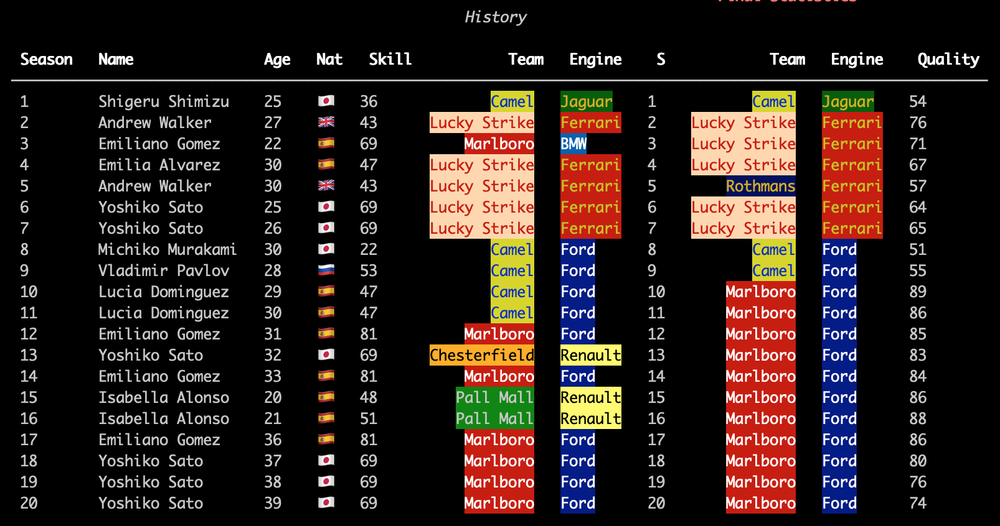
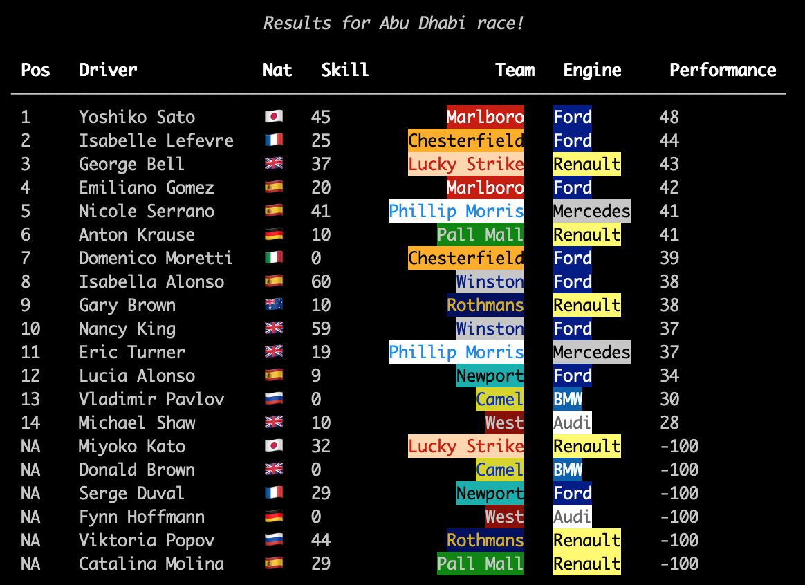
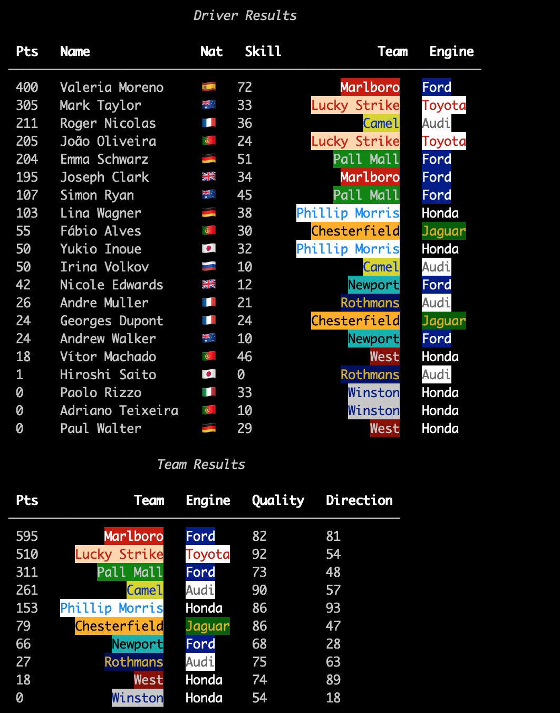
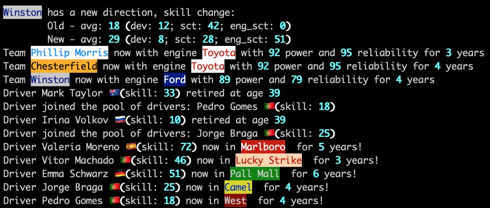

# F1 Procedural Generation

### About

This script generates a universe with F1 teams, drivers, races and seasons. 



For now the races are very abstract 
(basically a function of the drivers' skill, the car chassis and engine quality, the track characteristics and a random 
factor). 



The main goal of the project is to explore the procedural generation and progression of the universe, as well
as the AI the defines the teams strategies.




### Run

This program uses Python3. To run it, apart from having Python on your system, you have to install the requirements:

```
pip install requirements.txt
```

Then simply run the basic script: 

```
python basic.py
```

You can edit the various settings of the script on the `settings.py` file. 

### Future

There a lot of ideas for the future. The most ambitious one is to give more characteristics to the drivers and provide 
a more dynamic history of what happens throughout the simulation. For example, having driver rivalries that impact their
decisions, having events that effect the drivers skills or decisions, relations between drivers, teams and engine 
suppliers, etc. 

On the more near future, I aim to improve the AI, give more detail to the teams directions (introducing staff), and 
having more dynamic teams (teams created by enthusiasts such as McLaren and Williams, sponsored teams such as Benneton 
and Red Bull, or factory teams such as Ferrari and Renault) which can come and go along the simulation. 

Additionally, I would like to create more dynamic relations between teams and engine suppliers (e.g. works teams, 
exclusivity deals).

Finally, something that will always be on going is to add more driver nationalities 
(and maybe a more realistic way of deciding the country of origin).
